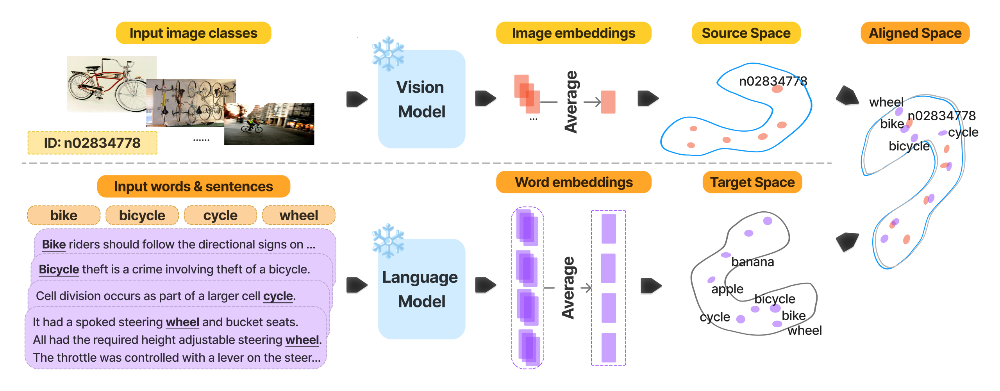

# Do Vision and Language Models Share Concepts? A Vector Space Alignment Study

<p align="center">
  
</p>

As discussed in [our paper](https://arxiv.org/abs/2302.06555), we have studied the question of whether LMs and VMs learn similar representations of the world, despite being trained on independent data from independent modalities. We present an empirical evaluation across four families of LMs ([BERT](https://arxiv.org/abs/1810.04805), [GPT-2](https://cdn.openai.com/better-language-models/language_models_are_unsupervised_multitask_learners.pdf), [OPT](https://arxiv.org/abs/2205.01068), and [LLaMA-2](https://arxiv.org/abs/2307.09288)) and three vision model architectures ([ResNet](https://arxiv.org/abs/1512.03385), [Segformer](https://arxiv.org/abs/2105.15203), and [MAE](https://arxiv.org/abs/2111.06377)). Our experiments show that LMs partially converge towards representations isomorphic to those of VMs.

## Getting Started
You can clone this repository issuing:
```bash
git clone git@github.com:jiaangli/VLCA.git
cd VLCA
git submodule update --init MUSE
```

1\. Create a fresh conda environment and install all dependencies.
```bash
conda create -n vlca python=3.11
conda activate vlca
pip install -r requirements.txt
```
2\. Datasets
As part of this work, we release the following datasets:

| Dataset | Dataset HF Alias |
| ---------- | ----------- |
| Common Words 79K | [`jaagli/common-words-79k`](https://huggingface.co/datasets/jaagli/common-words-79k)
| Unique Labels IMAGENET | [`jaagli/ul-imagenet`](https://huggingface.co/datasets/jaagli/ul-imagenet)
| English CLDI | [`jaagli/en-cldi`](https://huggingface.co/datasets/jaagli/en-cldi)

## How to run

Check available model configurations in [`config.py`](./src/config.py) under `MODEL_CONFIGS`, available saving paths of datasets under `DataConfig`, runtime parameters under `MuseConfig`, and various experimental types under `ExperimentType`.

Set the corresponding paths in all the files in [`conf`](./conf) folder.

Example to sequentially run GPT2 and OPT-125m models on ImageNet-21K dataset:

```bash
python main.py \
    --multirun \
    +model=gpt2,opt-125m \
    +dataset=imagenet \
    muse.exp_type=BASE
```
Or only run GPT-2 model on EN-CLDI dataset:
```bash
python main.py \
    +model=gpt2 \
    +dataset=cldi \
    muse.exp_type=BASE
```

## Citation
If you find our code, data or ideas useful in your research, please consider citing the paper:
```bibtex
@article{li2023implications,
  title={Do Vision and Language Models Share Concepts? A Vector Space Alignment Study},
  author={Li, Jiaang and Kementchedjhieva, Yova and Fierro, Constanza and S{\o}gaard, Anders},
  journal={arXiv preprint arXiv:2302.06555},
  year={2023}
}
```

## Acknowledgement

Our codebase heavily relies on these excellent repositories:
- [MUSE](https://github.com/facebookresearch/MUSE)
- [transformers](https://github.com/huggingface/transformers)